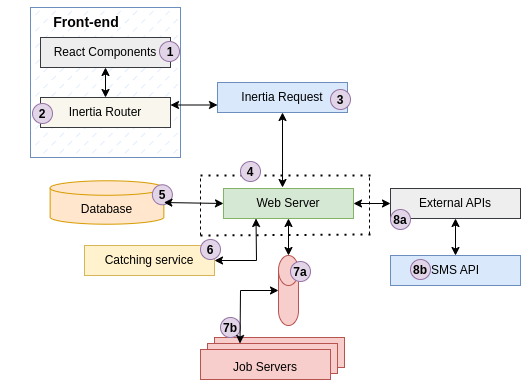
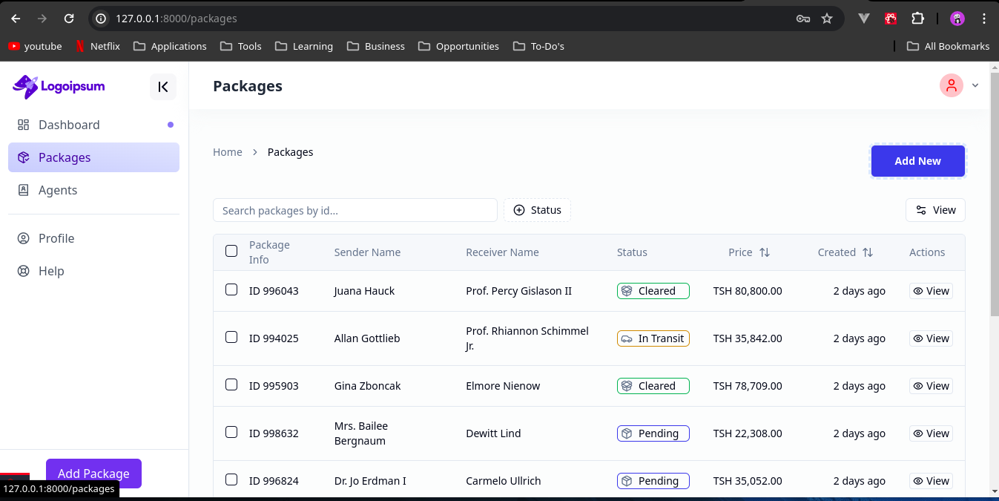

# Logistics Management System

### Table of Contents
1. [Project Overview](#project-overview)
2. [Features](#features)
3. [Technologies Used](#technologies-used)
4. [Installation](#installation)
5. [Configuration](#configuration)
6. [Usage](#usage)
7. [API Endpoints](#api-endpoints)
8. [Testing](#testing)
9. [Contributing](#contributing)
10. [License](#license)
11. [Screenshots](#screenshots)

## Project Overview

The Logistics Management System is a comprehensive solution designed to address common challenges faced by logistics companies. The application provides functionalities for managing merchants, users, and packages. It includes a robust package tracking system, real-time SMS notifications, and an admin dashboard for generating reports.

### Aplication architecture



---
**Note:**  This repository is not the official release nor repository of the Logistics Management System. It has been created primarily to showcase a school project. The official project release is not yet available.

## Features

- **Merchant Management**: Add, edit, and delete merchant profiles.
- **User Management**: Manage admin and agent users associated with merchants.
- **Package Management**: Track packages from origin to destination with detailed information.
- **Real-time Notifications**: Send SMS updates to customers about their shipment status.
- **Reports**: Generate and view detailed reports on package status and user activities.
- **Secure Authentication**: Role-based access control for admins and agents.

## Technologies Used

- **Backend**: Laravel
- **Frontend**: React with Inertia.js
- **Database**: MySQL
- **Server**: NGINX
- **Containerization**: Docker
- **Messaging**: SMS API integration
- **Version Control**: Git and GitHub

## Installation

### Prerequisites

- Docker and Docker Compose
- Node.js and npm
- Composer

### Steps

1. **Clone the Repository**:
    ```bash
    git clone https://github.com/?/Portfolio-Project

    cd logistics-management-system
    ```

2. **Environment Setup**:
    - Create a `.env` file from the example:
        ```bash
        cp .env.example .env
        ```
    - Update the `.env` file with your configuration details.

3. **Install Dependencies**:
    - Backend dependencies:
        ```bash
        composer install
        ```
    - Frontend dependencies:
        ```bash
        npm install
        ```

4. **Generate Application Key**:
    ```bash
    php artisan key:generate
    ```

5. **Run Migrations**:
    ```bash
    php artisan migrate
    ```

6. **Build and Run Docker Containers**:
    ```bash
    docker-compose up -d
    ```

## Configuration

Ensure you update the following configurations in your `.env` file:

- **Database Configuration**:
    ```
    DB_CONNECTION=mysql
    DB_HOST=mysql
    DB_PORT=3306
    DB_DATABASE=yourdatabase
    DB_USERNAME=yourusername
    DB_PASSWORD=yourpassword
    ```

- **SMS API Configuration**:
    ```
    SMS_API_URL=url
    SMS_API_KEY=yourapikey
    ```

## Usage

### Running the Application

1. **Start the Development Server**:
    ```bash
    npm run dev
    ```

2. **Access the Application**:
    Open your browser and navigate to `http://localhost` (or the configured domain).

### Deployment

1. **Build Assets for Production**:
    ```bash
    npm run build
    ```

2. **Deploy Using Docker**:
    Ensure your Docker containers are configured for production and deploy using:
    ```bash
    docker-compose -f docker-compose.prod.yml up -d
    ```

## API Endpoints

### Notifications
- **POST /api/notify-sender**: Send notification to sender
- **POST /api/notify-receiver**: Send notification to receiver
- **POST /api/notify-delivered**: Send delivery notification

## Testing

### Running Tests

- **Run Unit Tests**:
    ```bash
    php artisan test
    ```
- **Run Frontend Tests**:
    ```bash
    npm run test
    ```

### Postman

Import the provided Postman collection to test API endpoints.

## Screenshots



---

